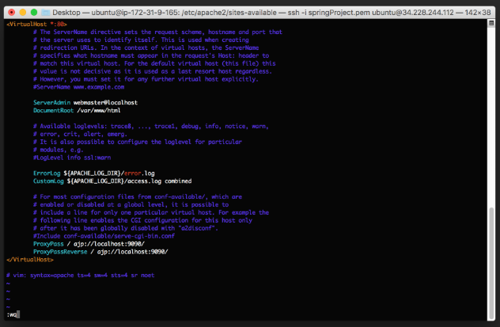
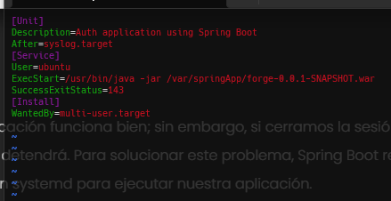

<h1 align="center">Bienvenido a examen final - Forge | WAR 👋</h1>
<p>
</p>

> Este fue el examen, donde se hicieron creaciones de relaciones y rutas springboot.

## Project Init

```
mvn spring-boot:run
```

## Apuntes AWS EC2

### 1.- Crear una instancia EC2

```
- Considerar la configuracion .PEM
- Considerar la tabla UBUNTU
- Considerar la configuracion de http - checkbox
- Considerar MY IP en las configuraciones
```

### 2.- Configurar instancia EC2

```
- Descargar el archivo y colocarlo en una carpeta con nombre deployment
- Ingresar a la consola de windows/linux y dirigirse a la carpeta de deployment
- Ya ubicado en la carpeta mediante la terminal poner el siguiente codigo "ssh -i .\"nombre de archivo pem".pem ubuntu@"IP de la instancia creada"
- En caso te de error ejecutar los siguientes codigos
    "icacls cdawskey.pem /reset"
    "icacls cdawskey.pem /grant:r "$($env:username):(r)"
    "icacls cdawskey.pem /inheritance:r"
- Actualizar ubunto con los siguientes comandos
    "sudo apt-get update"
    "sudo apt-get -y upgrade"
```

### 3.- Configurar Base de datos MySQL

```
- Instalar mysql con el siguiente comando "sudo apt-get install mysql-server"
- Configurar MYSQL -> ALTER USER 'root'@'localhost' IDENTIFIED WITH mysql_native_password BY 'root';
- Ejecutar "mysql -u root -p" o "sudo mysql -u root -p"
```

### 4.- Importar data MySQL - OPCIONAL

```
- Dirigirse a MySQL Workbench
- Seleccionar "Data export"
- Seleccionar las tablas
- Seleccionar
    "Export in Cump Project Folder"
    "create dump in a single transaction..."
    "include create schema"
- Pegar el contenido dentro de la consola dentro de la base de datos
```

### 5.- OTROS
```
- Instalar repositories:
    "sudo add-apt-repository ppa:linuxuprising/java"
    "sudo apt update"
    "sudo apt install oracle-java17-installer"
    "sudo apt-get install apache2"
```

### 6.- Implementacion del siguiente codigo en {Nombrede carpeta}Application

```java
@Bean
  public TomcatServletWebServerFactory servletContainer() {
    TomcatServletWebServerFactory tomcat = new TomcatServletWebServerFactory();
    Connector ajpConnector = new Connector("AJP/1.3");
    ajpConnector.setPort(9090);
    ajpConnector.setSecure(false);
    ajpConnector.setAllowTrace(false);
    ajpConnector.setScheme("http");

    ((AbstractAjpProtocol) ajpConnector.getProtocolHandler()).setSecretRequired(false);

    tomcat.addAdditionalTomcatConnectors(ajpConnector);
    return tomcat;
  }
```

### 7.- Crear el archivo war del spring boot
```
- Ejecutar "mvn clean install -U"
- Ejecutar "mvn install"
- Dirigirse a la carpeta Target de springboot, copiar el archivo war (El origin "NO") y pegarlo en tu carpeta de deployment
```

### 8.- Copiar el archivo war en directorio de EC2
```
"Recordar estar en la carpeta de delpoyment, con el archivo war y key"
- "scp -i {clave pem}.pem {nombre de archivo war}.war ubuntu@{numero de IP}:~/"
- Ingresar a ubuntu y crear las siguientes carpetas "sudo mkdir /var/springApp"
- Mover el archivo "sudo mv {nombre de archivo}.war /var/springApp"
```

### 9.- Configuracion en ubunto de aws
```
Instalar proxy de apache
- sudo a2enmod proxy
- sudo a2enmod proxy_ajp
Ejecutar el vim
- /etc/apache2/sites-available
- "sudo vim 000-default.conf"
```
Te aparecera la siguiente consola:

```
- Apretar la letra " i "
Agregar las 2 ultimas linea:
ProxyPass / ajp:/localhost:9090/
ProxyPassReverse / ajp://localhost:9090/
- Darlea a la tecla ESC y escribir "!wq" - Enter para salir
Reinicia Apache
- "sudo service apache2 restart"
```

### 10.- JDK
```
- Instalar el JDK "sudo apt-get install default-jdk"
- Probarlo - Dirigirse a 
    cd /var/springApp
    "java -jar {nombre de tu war}.war"
```

### 11.- Systemd
```
- cd /etc/systemd/system
- sudo touch {nombre a colocar al servicio}.service
- sudo vim {nombre a colocar al servicio}.service
- Se mostrara la siguiente config, agregarla 
[Unit]
Description=Auth application using Spring Boot
After=syslog.target
[Service]
User=ubuntu
ExecStart=/usr/bin/java -jar /var/springApp/{modificar a nombre usado}.war
SuccessExitStatus=143
[Install]
WantedBy=multi-user.target
```

```
- sudo systemctl daemon-reload
- sudo systemctl enable {nombre del servicio}.service
- sudo systemctl start {nombre del servicio}
- Verificar que este activo el servidor "systemctl status {nombre de servicio}"
- Demas "sudo systemctl stop {nombre de servicio}" , "sudo systemctl restart {nombre de servicio}"
```

ADVERTENCIA - Si el estado te aparece de forma activa, esperar unas horas para recien probar tu IP, no es de forma instante

## Author

👤 **Marcos Alanya**
